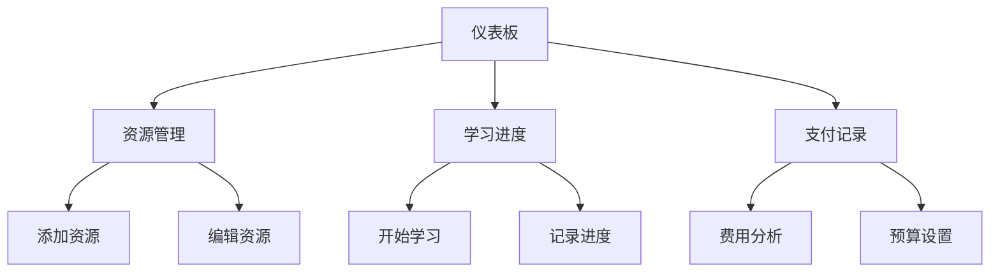

## 1. 产品概述

个人知识付费清单与学习进度跟踪系统，帮助用户管理知识付费资源、跟踪学习进度、统计学习数据。解决用户在知识付费时代资源分散、学习进度难以追踪、投入产出比不清晰的问题。

目标用户为知识付费学习者、自我提升人群，通过系统化管理提高学习效率，量化学习投入与产出。

## 2. 核心功能

### 2.1 用户角色

本系统为个人使用工具，暂不区分用户角色，所有功能对单一用户开放。

### 2.2 功能模块

系统包含以下主要页面：

1. **仪表板页面**：数据概览、学习统计、进度图表、最近活动。
2. **资源管理页面**：资源列表、添加编辑、分类筛选、状态管理。
3. **学习进度页面**：进度跟踪、时间记录、完成情况、学习历史。
4. **支付记录页面**：费用统计、支出分析。

### 2.3 页面详情

| 页面名称   | 模块名称 | 功能描述                            |
| ------ | ---- | ------------------------------- |
| 仪表板页面  | 数据概览 | 显示总资源数、进行中资源数、已完成资源数、总投入金额等核心数据 |
| 仪表板页面  | 学习统计 | 展示本周/本月学习时长、学习频率、完成率等统计图表       |
| 仪表板页面  | 进度图表 | 可视化展示各类别资源学习进度、费用投入分布           |
| 仪表板页面  | 最近活动 | 显示最近添加、更新、完成的学习资源记录             |
| 资源管理页面 | 资源列表 | 展示所有知识资源，支持按状态、分类、进度筛选排序        |
| 资源管理页面 | 添加编辑 | 表单录入资源信息：标题、描述、价格、资源类型（网课/训练营/社群/书籍）、分类、购买链接、状态等   |
| 资源管理页面 | 分类筛选 | 按预设分类（网课、训练营、社群、书籍）筛选资源            |
| 资源管理页面 | 状态管理 | 标记资源状态：未开始、进行中、已完成、暂停/搁置、已放弃    |
| 学习进度页面 | 进度跟踪 | 记录每个资源的学习进度百分比                  |
| 学习进度页面 | 时间记录 | 记录每次学习开始结束时间，自动计算学习时长           |
| 学习进度页面 | 完成情况 | 标记完成状态，记录完成时间，生成完成证书            |
| 学习进度页面 | 学习历史 | 展示所有学习记录时间线，支持查看历史详情            |
| 支付记录页面 | 费用统计 | 按时间维度统计支出，计算平均每资源投入成本           |
| 支付记录页面 | 支出分析 | 分类别、分状态的支出分析，生成投入产出比            |

## 3. 核心流程

### 主要用户操作流程：

1. **资源录入流程**：进入资源管理页面 → 点击添加资源 → 填写资源信息 → 设置分类和价格 → 保存资源
2. **学习跟踪流程**：选择学习资源 → 开始学习计时 → 记录学习笔记 → 更新学习进度 → 完成学习记录
3. **数据分析流程**：查看仪表板 → 查看各项统计数据 → 分析学习效率和投入产出 → 调整学习计划

## 4. 用户界面设计

### 4.1 设计风格

* **主色调**：蓝色系（#3B82F6）为主，绿色（#10B981）表示完成状态，橙色（#F59E0B）表示进行中

* **按钮样式**：圆角矩形，主要操作为实心按钮，次要操作为边框按钮

* **字体**：系统默认字体，标题16-18px，正文14px，小字12px

* **布局风格**：卡片式布局，顶部导航栏，侧边栏分类筛选

* **图标风格**：使用简洁的线性图标，状态用颜色和图标双重标识

### 4.2 页面设计概览

| 页面名称   | 模块名称 | UI元素                     |
| ------ | ---- | ------------------------ |
| 仪表板页面  | 数据概览 | 顶部四个统计卡片，大数字显示，使用图标和颜色区分 |
| 仪表板页面  | 学习统计 | 圆环图显示完成率，折线图显示学习趋势       |
| 仪表板页面  | 进度图表 | 横向条形图展示各类别进度，支持点击查看详情    |
| 仪表板页面  | 最近活动 | 时间线形式展示，包含时间、操作、资源名称     |
| 资源管理页面 | 资源列表 | 卡片网格布局，每张卡片显示封面、标题、进度、状态 |
| 资源管理页面 | 添加编辑 | 模态框表单，分组显示基本信息、价格信息、分类信息 |
| 资源管理页面 | 分类筛选 | 顶部标签页形式，支持多选组合筛选         |
| 学习进度页面 | 进度跟踪 | 进度条+百分比显示，支持拖拽调整进度       |
| 学习进度页面 | 时间记录 | 计时器界面，开始/暂停按钮，实时显示学习时长   |
| 支付记录页面 | 费用统计 | 柱状图+数据表格，支持时间段筛选         |
| 支付记录页面 | 支出分析 | 饼图显示分类占比，列表显示详细支出记录      |

### 4.3 响应式设计

* **桌面优先**：基于1920px宽度设计，支持1200px以上大屏

* **移动端适配**：768px以下切换为移动布局，底部导航栏

* **触摸优化**：按钮最小44px，支持滑动手势操作

* **断点设置**：1200px（桌面）、768px（平板）、480px（手机）

