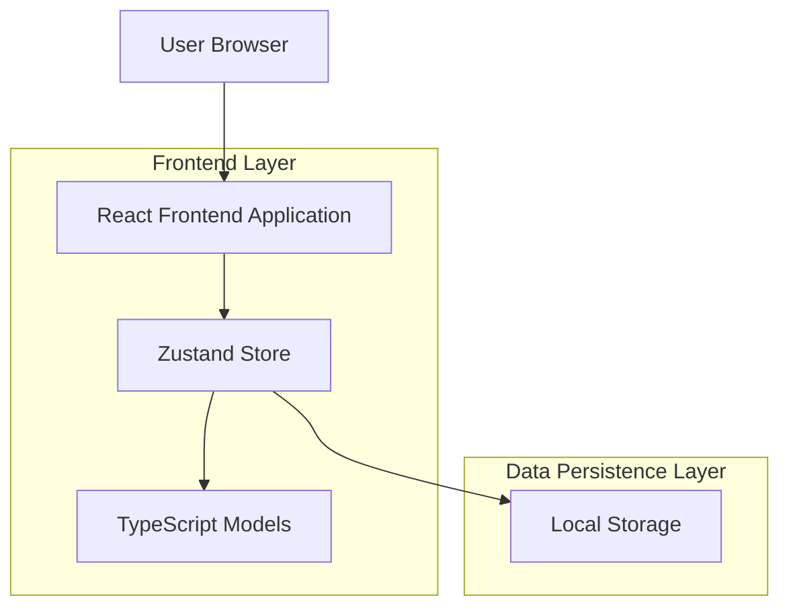
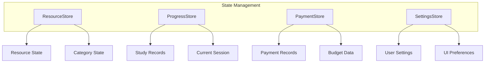

## 1. 架构设计



## 2. 技术描述

* 前端：React\@18 + TypeScript + Tailwind CSS\@3 + Vite

* 状态管理：Zustand\@4

* 路由：React Router\@6

* 图表库：Recharts\@2

* 图标：Lucide React

* 数据存储：浏览器 Local Storage

* 构建工具：Vite\@4

## 3. 路由定义

| 路由                  | 用途                |
| ------------------- | ----------------- |
| /                   | 仪表板页面，显示学习概览和统计数据 |
| /resources          | 资源管理页面，管理所有知识资源   |
| /resources/new      | 新建资源页面，添加新的学习资源   |
| /resources/:id/edit | 编辑资源页面，修改资源信息     |
| /progress           | 学习进度页面，跟踪和管理学习进度  |
| /payments           | 支付记录页面，管理费用和分析投入  |
| /settings           | 设置页面，配置系统参数和偏好    |

## 4. 数据模型定义

### 4.1 TypeScript 接口定义

```typescript
// 资源分类接口
interface Category {
  id: string;
  name: string;
  color: string;
  icon: string;
  createdAt: Date;
}

// 资源筛选条件接口
interface ResourceFilters {
  resourceType?: '网课' | '训练营' | '社群' | '书籍';
  categoryId?: string;
  status?: 'not_started' | 'in_progress' | 'completed' | 'abandoned';
  priceRange?: [number, number];
  progressRange?: [number, number];
  tags?: string[];
}

// 学习资源接口
interface Resource {
  id: string;
  title: string;
  description: string;
  resourceType: '网课' | '训练营' | '社群' | '书籍';
  categoryId: string;
  price: number;
  currency: string;
  purchaseUrl?: string;
  status: 'not_started' | 'in_progress' | 'completed' | 'abandoned';
  progress: number; // 0-100
  startDate?: Date;
  completedDate?: Date;
  estimatedHours?: number;
  actualHours: number;
  notes: string[];
  tags: string[];
  createdAt: Date;
  updatedAt: Date;
}

// 学习记录接口
interface StudyRecord {
  id: string;
  resourceId: string;
  startTime: Date;
  endTime?: Date;
  duration: number; // 分钟
  notes: string;
  progressBefore: number;
  progressAfter: number;
  createdAt: Date;
}

// 支付记录接口
interface PaymentRecord {
  id: string;
  resourceId: string;
  amount: number;
  currency: string;
  paymentDate: Date;
  paymentMethod: string;
  notes?: string;
  createdAt: Date;
}

// 用户设置接口
interface UserSettings {
  monthlyBudget: number;
  yearlyBudget: number;
  defaultCurrency: string;
  theme: 'light' | 'dark';
  notifications: boolean;
  createdAt: Date;
  updatedAt: Date;
}
```

## 5. Zustand 状态管理架构



### 5.1 Store 定义

```typescript
// 资源管理 Store
interface ResourceStore {
  resources: Resource[];
  categories: Category[];
  loading: boolean;
  filters: ResourceFilters;
  addResource: (resource: Omit<Resource, 'id' | 'createdAt' | 'updatedAt'>) => void;
  updateResource: (id: string, updates: Partial<Resource>) => void;
  deleteResource: (id: string) => void;
  setFilter: (filters: ResourceFilters) => void;
  getResourceTypes: () => Array<'网课' | '训练营' | '社群' | '书籍'>;
}

// 学习进度 Store
interface ProgressStore {
  studyRecords: StudyRecord[];
  currentSession?: StudySession;
  startStudySession: (resourceId: string) => void;
  endStudySession: (notes: string, progress: number) => void;
  getResourceProgress: (resourceId: string) => StudyRecord[];
}

// 支付管理 Store
interface PaymentStore {
  payments: PaymentRecord[];
  totalSpent: number;
  monthlySpending: number;
  addPayment: (payment: Omit<PaymentRecord, 'id' | 'createdAt'>) => void;
  getResourcePayments: (resourceId: string) => PaymentRecord[];
  calculateROI: () => number;
}
```

## 6. 本地存储设计

### 6.1 存储结构

```typescript
// 本地存储键定义
const STORAGE_KEYS = {
  RESOURCES: 'knowledge_resources',
  CATEGORIES: 'resource_categories',
  STUDY_RECORDS: 'study_records',
  PAYMENT_RECORDS: 'payment_records',
  USER_SETTINGS: 'user_settings',
  LAST_SYNC: 'last_sync_time'
} as const;

// 数据迁移接口
interface Migration {
  version: number;
  migrate: (data: any) => any;
}

// 存储工具类
class LocalStorageManager {
  static save<T>(key: string, data: T): void;
  static load<T>(key: string, defaultValue: T): T;
  static remove(key: string): void;
  static clear(): void;
  static export(): string;
  static import(data: string): boolean;
}
```

### 6.2 数据备份与恢复

```typescript
// 数据备份接口
interface DataBackup {
  version: string;
  timestamp: Date;
  data: {
    resources: Resource[];
    categories: Category[];
    studyRecords: StudyRecord[];
    payments: PaymentRecord[];
    settings: UserSettings;
  };
}

// 自动备份服务
class AutoBackupService {
  static enable(interval: number): void;
  static disable(): void;
  static backup(): Promise<void>;
  static restore(backup: DataBackup): Promise<boolean>;
}
```

## 7. 组件架构

### 7.1 页面组件结构

```
src/
├── components/
│   ├── common/
│   │   ├── Header.tsx
│   │   ├── Sidebar.tsx
│   │   ├── LoadingSpinner.tsx
│   │   └── ErrorBoundary.tsx
│   ├── dashboard/
│   │   ├── StatsCards.tsx
│   │   ├── ProgressChart.tsx
│   │   ├── SpendingChart.tsx
│   │   └── RecentActivity.tsx
│   ├── resources/
│   │   ├── ResourceCard.tsx
│   │   ├── ResourceForm.tsx
│   │   ├── ResourceFilter.tsx
│   │   └── ResourceList.tsx
│   ├── progress/
│   │   ├── StudyTimer.tsx
│   │   ├── ProgressTracker.tsx
│   │   ├── StudyHistory.tsx
│   │   └── ProgressChart.tsx
│   └── payments/
│       ├── PaymentForm.tsx
│       ├── SpendingAnalysis.tsx
│       ├── BudgetTracker.tsx
│       └── ROIChart.tsx
├── pages/
│   ├── Dashboard.tsx
│   ├── Resources.tsx
│   ├── ResourceForm.tsx
│   ├── Progress.tsx
│   ├── Payments.tsx
│   └── Settings.tsx
├── stores/
│   ├── resourceStore.ts
│   ├── progressStore.ts
│   ├── paymentStore.ts
│   └── settingsStore.ts
├── types/
│   ├── resource.types.ts
│   ├── progress.types.ts
│   ├── payment.types.ts
│   └── common.types.ts
├── utils/
│   ├── storage.ts
│   ├── calculations.ts
│   ├── formatters.ts
│   └── validators.ts
└── hooks/
    ├── useLocalStorage.ts
    ├── useStudyTimer.ts
    ├── useFilters.ts
    └── useCalculations.ts
```

## 8. 工具函数

### 8.1 计算工具

```typescript
// 学习统计计算
class StudyCalculator {
  static calculateTotalHours(records: StudyRecord[]): number;
  static calculateAverageProgress(resources: Resource[]): number;
  static calculateCompletionRate(resources: Resource[]): number;
  static calculateStudyStreak(records: StudyRecord[]): number;
}

// 费用分析工具
class PaymentCalculator {
  static calculateTotalSpending(payments: PaymentRecord[]): number;
  static calculateAverageCost(resources: Resource[], payments: PaymentRecord[]): number;
  static calculateCategorySpending(payments: PaymentRecord[], categoryId: string): number;
  static calculateROI(resources: Resource[], payments: PaymentRecord[]): number;
}

// 数据格式化工具
class DataFormatter {
  static formatCurrency(amount: number, currency: string): string;
  static formatDuration(minutes: number): string;
  static formatDate(date: Date, format: string): string;
  static formatProgress(progress: number): string;
}
```

## 9. 性能优化

### 9.1 虚拟滚动

对于大量资源列表，实现虚拟滚动优化：

```typescript
// 虚拟列表组件
interface VirtualListProps<T> {
  items: T[];
  itemHeight: number;
  renderItem: (item: T, index: number) => React.ReactNode;
  containerHeight: number;
}
```

### 9.2 数据缓存

实现智能数据缓存策略，减少本地存储读写：

```typescript
// 缓存管理器
class CacheManager {
  static set<T>(key: string, data: T, ttl?: number): void;
  static get<T>(key: string): T | null;
  static invalidate(pattern: string): void;
  static clear(): void;
}
```

## 10. 错误处理

### 10.1 错误边界

```typescript
// 错误边界组件
interface ErrorBoundaryState {
  hasError: boolean;
  error: Error | null;
  errorInfo: ErrorInfo | null;
}

class ErrorBoundary extends Component<Props, ErrorBoundaryState> {
  static getDerivedStateFromError(error: Error): ErrorBoundaryState;
  componentDidCatch(error: Error, errorInfo: ErrorInfo): void;
}
```

### 10.2 数据验证

```typescript
// 数据验证工具
class DataValidator {
  static validateResource(resource: Partial<Resource>): ValidationResult;
  static validatePayment(payment: Partial<PaymentRecord>): ValidationResult;
  static validateSettings(settings: Partial<UserSettings>): ValidationResult;
}

interface ValidationResult {
  isValid: boolean;
  errors: ValidationError[];
}
```

